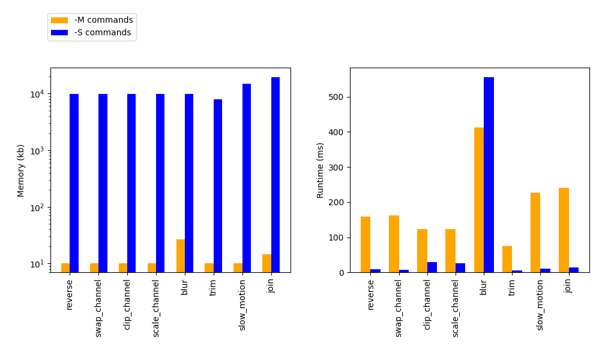

# LibFilmMaster2000

**Programming Paradigms - 75/100**
*Project details removed due to module restrictions*

A lightweight video editing library, implemented in C and utilised through the command line.

Bit-level pixel operations with a decoding and encoding pipeline on binary files. Designated run modes prioritising either speed or memory usage.

### Run Mode Performance

### Reverse
Reverses the input video

### Channel Swap
Swaps the values between two target channels

### Channel Clip
Clips the values of a channel to the given range

# Channel Scale
Scales the values of a channel by the factor

### Blur
Applies Gaussian blur

### Slow Motion
Slows the video by the given factor

### Trim
Trims the video to a given range of frames

### Join
Concatenates two input videos (original joined to reversed in the example)

